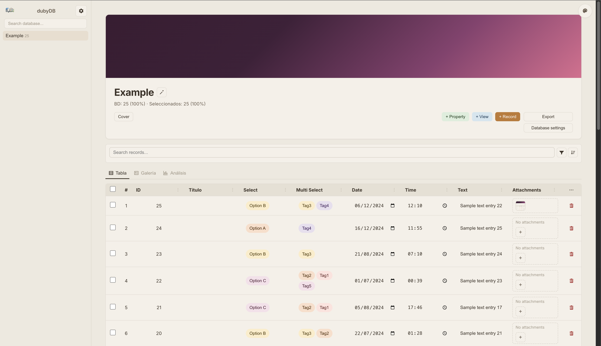
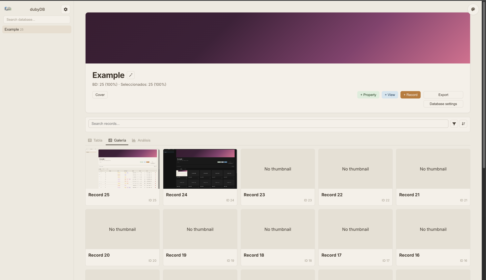
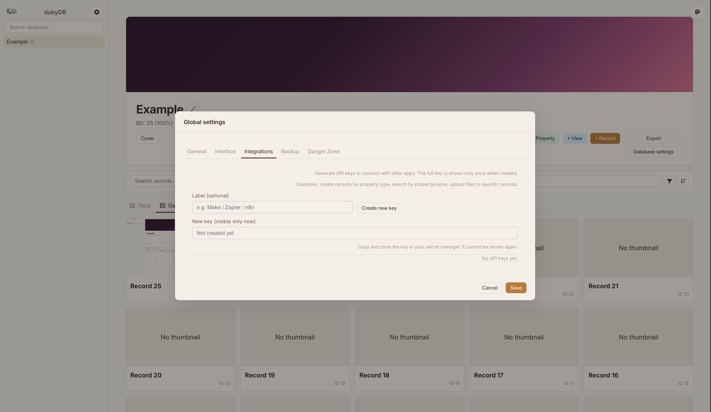

# dubyDB

A visual database-style web app (Notion-like) to create folders, databases, properties, records, relations, attachments, and analytics views.

## What's New

- Attachments with upload indicator: when uploading a file, a spinning circle appears until the upload is complete.
- File-type icons: non-image attachments show a video or audio icon when applicable (instead of the generic document icon).
- Drag-and-drop table column reordering: order is saved in the active view configuration and persists across sessions and devices.
- API key management from global settings for integration with the dubyDB API.

## Quick Summary

With dubyDB you can:
- Create folders and databases.
- Define dynamic columns (text, dates, select, attachments, relation, rollup, etc.).
- Store file attachments.
- Reorder table columns by dragging headers.
- Manage API keys for programmatic access.
- Create backups and restore them.
- Change global app settings.

---

## Screenshots





---

## Table of Contents

1. [Requirements](#requirements)
2. [Super Easy Installation with Docker Compose (Recommended)](#super-easy-installation-with-docker-compose-recommended)
3. [Installation with Docker (Without Compose)](#installation-with-docker-without-compose)
4. [Local Installation (Without Docker)](#local-installation-without-docker)
5. [How to Access the App](#how-to-access-the-app)
6. [Where Data Is Stored](#where-data-is-stored)
7. [Danger Zone (Full Wipe)](#danger-zone-full-wipe)
8. [Troubleshooting](#troubleshooting)
9. [API keys](#api-keys)
10. [API integration quick guide](#api-integration-quick-guide)

---

## Requirements

Only one of these options is needed:

- **Option A (recommended):** Docker Desktop installed.
- **Option B:** Node.js 20+ and npm installed.

If you're not sure which one to use, choose **Docker Desktop**.

---

## Super Easy Installation with Docker Compose (Recommended)

> Run this from the project root folder (where `docker-compose.yml` is located).

### Step 1: open a terminal in the project folder

Example:

```bash
cd /ruta/a/dubyDB
```

### Step 2: start the app

```bash
docker compose up -d --build
```

### Step 3: open in browser

Go to:

```text
http://localhost:7192
```

### To stop it

```bash
docker compose down
```

---

## Installation with Docker (Without Compose)

> Use this if you prefer standalone Docker commands.

### Step 1: build the image

```bash
cd /ruta/a/dubyDB/app
docker build -t dubydb-app .
```

### Step 2: run the container

From the project root (to mount `./data`):

```bash
cd /ruta/a/dubyDB
docker run --rm -p 7192:7192 -e DATA_DIR=/data -v "$(pwd)/data:/data" dubydb-app
```

### Step 3: open in browser

```text
http://localhost:7192
```

---

## Local Installation (Without Docker)

### Step 1: install dependencies

```bash
cd /ruta/a/dubyDB/app
npm install
```

### Step 2: start the server

```bash
npm start
```

### Step 3: open in browser

```text
http://localhost:7192
```

---

## How to Access the App

Once started, open:

- `http://localhost:7192`

If it doesn’t load, make sure port 7192 is not in use.

---

## Where Data Is Stored

- With Docker Compose: in the project `./data` folder.
- In local mode: by default in `app/data`.

This is where the SQLite database, attachments, and restore temporary files are stored.

---

## Danger Zone (Full Wipe)

In the app:

1. Click the **General settings** icon (⚙️, at the top of the sidebar).
2. Open the **Danger Zone** tab.
3. Click **Delete all data**.
4. Confirm in the modal.

This removes all saved content:
- folders
- databases
- records
- attachments
- saved configuration

This action cannot be undone.

---

## API keys

The app lets you create and revoke API keys from **General settings**.

Recommended usage:

- Create one key per external integration.
- Store each key in a secure secrets manager.
- Revoke keys immediately when no longer needed.

## API integration quick guide

You can now identify each database with an `api_code` and resolve its numeric ID at runtime.

### Resolve database ID by code

- `GET /api/databases/resolve/:code`
- Example response:

```json
{
  "id": 3,
  "name": "Clientes",
  "code": "db_a1b2c3d4e5"
}
```

### Main endpoints

These routes accept either the numeric ID or the database code in `:id`:

- `GET /api/databases/:id`
- `GET /api/databases/:id/records`
- `POST /api/databases/:id/records`
- `POST /api/databases/:id/properties`
- `POST /api/databases/:id/analysis`
- `GET /api/databases/:id/export`

### Upload files to a concrete record

- `POST /api/records/:recordId/attachments/:propertyId`
- Content type: `multipart/form-data`
- Form field name: `file`

### Auth headers (when API key is required)

- `x-api-key: duby_xxx`
- or `Authorization: Bearer duby_xxx`

---

## Troubleshooting

### `http://localhost:7192` does not open

- Verify the app is running.
- If you use Docker Compose:
  ```bash
  docker compose ps
  ```
- If you use local mode, check for errors in the terminal.

### Port is already in use

Stop the process using port 7192 or change the port when starting the app.

### I want to start from scratch

Use the **Danger Zone** tab inside the app to delete all data.
