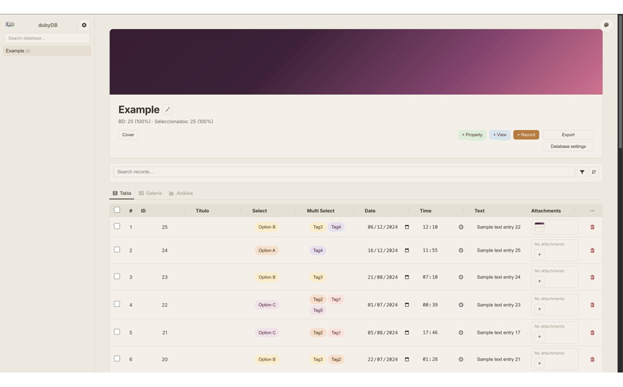
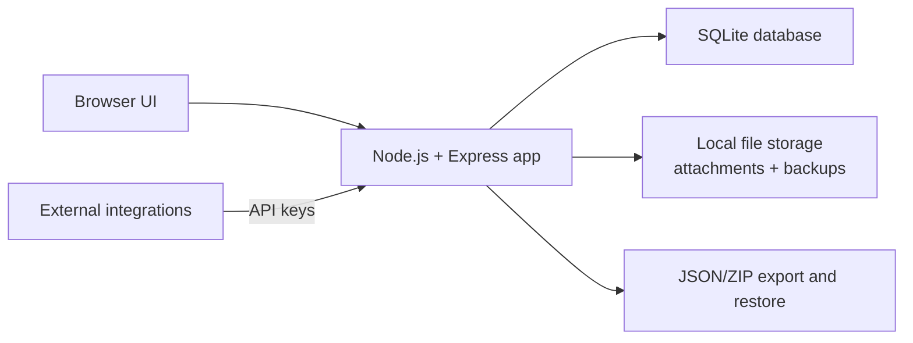

# dubyDB

**dubyDB is a self-hosted database workspace for teams that need flexible records, files, saved views, analytics, backups, and API access without building a custom backoffice from scratch.**

dubyDB sits in the space between fragile spreadsheets, overly loose documentation tools, and expensive one-off internal tools. It gives you dynamic schemas, attachments, grouped filters, analytics, audit traces, backups, and API keys in one portable product built on SQLite.

Current version: `1.1.0`

## What dubyDB is for

dubyDB is designed for people who need structure and flexibility at the same time:

- Researchers managing datasets, references, sources, and attached material.
- Operations teams tracking records, statuses, files, and recent activity.
- Archives and collections teams organizing visual assets and metadata.
- Small businesses that need a lightweight CRM, inventory, or project workspace.
- Builders who want a real data product they can self-host and extend through an API.

## Why use dubyDB

- **Portable by default.** Data lives in SQLite plus local files, so backup and restore stay simple.
- **More structured than documents.** Dynamic properties, views, grouping, relations, and rollups make the data usable.
- **Faster than building your own tool.** You get records, files, API keys, backups, analytics, and audit history out of the box.
- **More ownership than hosted tools.** Self-hosting, explicit backups, and local data storage reduce lock-in.
- **Built for real workflows.** Files, metadata, saved views, and recent activity live in the same product instead of separate tools.

## Why teams choose it over other options

| If you are comparing against... | dubyDB gives you... |
| --- | --- |
| Spreadsheets | Relations, attachments, saved views, grouped filters, analytics, and better structure for mixed data. |
| Generic note/database apps | A portable self-hosted stack, local ownership of files, explicit backups, and API-level control. |
| Custom internal tools | A working product now, with enough flexibility to model your workflow before writing custom software. |

## See it in 30 seconds



The short demo above cycles through the main workspace, a database view, and global settings.

| Workspace | Database view | Settings and API |
| --- | --- | --- |
|  |  |  |

## Real-world use cases

- **Photo archive**: manage images, authors, albums, capture dates, tags, and file attachments.
- **Bibliography**: track papers, reading status, DOI/URL, topics, notes, and PDFs.
- **Inventory**: organize items by category, quantity, location, evidence files, and updates.
- **Simple CRM**: store contacts, stage, estimated value, next step, notes, and supporting files.
- **Project workspace**: manage tasks, status, ownership, due dates, labels, and recent activity.
- **Research dataset**: structure samples, sources, dates, null checks, relations, and exports.

## Core capabilities

- Dynamic database creation with custom properties.
- Database templates for photo archives, bibliography, inventory, CRM, projects, and research datasets.
- Table, gallery, and analytics views over the same dataset.
- Persistent advanced filters with grouped `AND/OR`, date ranges, empty/non-empty checks, relation-aware filtering, multi-sort, and grouping.
- File attachments with drag and drop, upload feedback, file-type previews, and recent attachment browsing.
- View favorites, saved view configuration, and per-view column order.
- Basic audit history for records and recent activity at the database level.
- API keys with scopes, optional expiry, and usage traces.
- Database export/restore plus full portfolio backup/restore.
- CSV import for creating new databases from tabular data.

## Architecture at a glance



Simple stack:

- **Frontend**: vanilla HTML, CSS, and JavaScript.
- **Backend**: Node.js + Express.
- **Persistence**: SQLite for schemas, records, views, API keys, audit log, and settings.
- **Files**: local filesystem for uploads and backup artifacts.
- **Testing**: Node integration tests covering critical API and data flows.

## Quick start

### Option A: Docker Compose (recommended)

Run from the project root:

```bash
docker compose up -d --build
```

Open:

```text
http://localhost:7192
```

Stop:

```bash
docker compose down
```

### Option B: Docker only

Build from `app/`:

```bash
cd app
docker build -t dubydb-app .
```

Run from the project root:

```bash
docker run --rm -p 7192:7192 -e DATA_DIR=/data -v "$(pwd)/data:/data" dubydb-app
```

### Option C: Local development

```bash
cd app
npm install
npm start
```

Then open:

```text
http://localhost:7192
```

## Where data lives

- With Docker Compose: `./data`
- In local mode: `app/data`

This directory stores the SQLite database, attachments, backup snapshots, and restore temp files.

## API and integrations

dubyDB can be used from external tools through API keys created in the app settings.

API key features:

- Optional expiry
- Coarse scopes: `read`, `write`, `analytics`, `settings`, `backup`, `*`
- Usage traces (`lastUsedAt`, usage count, active/expired state)

Useful routes:

- `GET /api/databases/resolve/:code`
- `GET /api/databases/:id`
- `GET /api/databases/:id/records`
- `POST /api/databases/:id/records`
- `POST /api/databases/:id/properties`
- `POST /api/databases/:id/analysis`
- `GET /api/databases/:id/export`
- `POST /api/records/:recordId/attachments/:propertyId`
- `GET /api/records/:id/activity`
- `GET /api/databases/:id/activity`

Auth headers:

- `x-api-key: duby_xxx`
- `Authorization: Bearer duby_xxx`

Attachment uploads use `multipart/form-data` and the `files` field name.

## Testing and technical quality

Run the test suite from `app/`:

```bash
cd app
npm test
```

Current automated coverage includes:

- relations and rollups
- templates, grouped filters, analytics, and multi-attachment uploads
- API key scopes and expiry
- validation for URL/date/time fields
- database export/restore and full portfolio restore

If `better-sqlite3` was compiled for a different Node runtime, rebuild it first:

```bash
cd app
npm rebuild better-sqlite3
```

## FAQ

### Is dubyDB cloud software or self-hosted software?

It is self-hosted. You run it with Docker or directly with Node.js.

### Where are my files and records stored?

Records, schemas, saved views, settings, API keys, and audit data are stored in SQLite. Attachments and backup artifacts live on the local filesystem.

### Can I import and export data?

Yes. The app supports CSV import, per-database export/restore, and full portfolio backup/restore.

### Does dubyDB support files, relations, and analytics in the same product?

Yes. Files, dynamic properties, relations, rollups, saved views, and analytics are part of the same app.

### Can I control API access?

Yes. API keys can be scoped, expired, revoked, and traced at a basic level.

### Is there an audit trail?

Yes. The backend stores a basic activity log for records, attachments, schema changes, backup/restore actions, and API key lifecycle events.

### Is it ready for serious use?

It is built for real self-hosted workflows and already includes tests, backups, validation, and release notes. Browser-based UI smoke testing is still on the roadmap.

### How do I wipe everything and start over?

Use the **Danger Zone** inside the app settings and choose **Delete all data**.

## Roadmap

Near-term priorities:

- browser-based smoke tests for critical UI flows
- richer migration helpers and rollback-friendly dry runs
- more filtering for database-level activity
- narrower API scopes where needed
- stronger release discipline and signed release flow

See the full roadmap in [ROADMAP.md](ROADMAP.md).

## Changelog and project history

- Release notes: [CHANGELOG.md](CHANGELOG.md)
- Roadmap: [ROADMAP.md](ROADMAP.md)
- License: [LICENSE](LICENSE)

## Troubleshooting

### `http://localhost:7192` does not open

- Make sure the app is running.
- If you use Docker Compose, run `docker compose ps`.
- If you use local mode, check the server terminal for startup errors.

### Port `7192` is already in use

Stop the conflicting process or change the exposed port.

### Tests fail after switching Node versions

Rebuild the native SQLite dependency:

```bash
cd app
npm rebuild better-sqlite3
```

